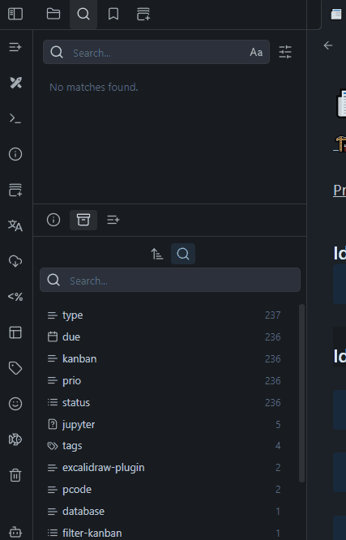

# Better Properties Lookup

A plugin for [Obsidian](https://obsidian.md) that enhances property management by displaying file properties in a hierarchical sidebar view.

### 🧩 Key Features
- Displays all vault properties in a dedicated sidebar panel with hierarchical tree view
- Supports combining multiple property filters for advanced note searching
- Includes powerful search functionality to quickly find specific properties
- Provides detailed usage statistics showing how many notes use each property
- Offers convenient right-click context menu with multiple actions for each property
- Allows customization through comprehensive settings

### 🛠️ Installation
#### From Obsidian Community Plugins
- Open Obsidian Settings
- Navigate to "Community plugins"
- Click "Browse" and search for "Better Properties Lookup"
- Install the plugin and enable it
- Check the Better Properties Lookup settings to customize your experience

#### Manual Installation
- Download the latest release from the [GitHub repository](https://github.com/MavisNeun/better-properties-lookup/releases)
- Extract the files to your Obsidian vault's `.obsidian/plugins/better-properties-lookup` directory
- Enable the plugin in Obsidian's Community Plugins settings

### 🚀 Getting Started
- Click the "Better Properties Lookup" icon in the left sidebar
- Properties from all notes will be displayed in a hierarchical tree
- Click on property names to expand/collapse their sections
- Right-click on a property value to access the context menu with options:
  - Create a new search for all notes containing that property and value
  - Add the property to your current search
  - Add exclusion to search
  - Copy just the value to clipboard
  - Copy property and value in "property: value" format

### 📌 Usage Tips
- Use the search bar at the top to filter properties by name or value
- Click the sort button to organize properties alphabetically or by frequency
- Toggle expand/collapse all to quickly navigate large property trees
- Use the reindex button to manually rebuild the property index after bulk changes
- Enable the fixed toolbar in settings for easier navigation with large property lists

### 🗨️ Advanced Features
- **Property Filtering**: Show only the properties you care about by configuring included/excluded properties in settings
- **Multi-property Searches**: Build complex searches by adding multiple property conditions
- **Condensed View**: Enable condensed display in settings for a more compact interface
- **Fixed Toolbar**: Keep the toolbar visible while scrolling through large property lists

### 🔧 Settings & Customization
- **Behavior Settings**: Control default expansion and search behavior
- **Sorting & Filtering**: Customize which properties are shown or hidden

